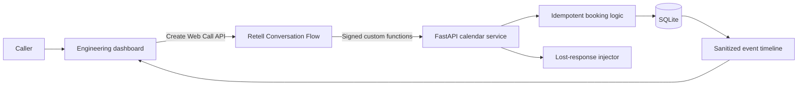

# Retell Dental Booking Reliability Lab

A small, real Retell AI integration that demonstrates how a customer deployment can prevent duplicate appointments when a calendar operation succeeds, its response is lost, and Retell retries the request.

> **Project status:** the FastAPI foundation, SQLite calendar schema, deterministic demo seed/reset, availability lookup, idempotent booking, sanitized request-event timeline, lost-response Failure Lab, Retell signature verification, and the signed `check_availability` and `book_appointment` custom functions are in place. Web-call creation and end-to-end validation are still pending. Any result described below is a target acceptance criterion until a real Retell run is captured.

## The customer problem

Imagine a dental voice agent booking an appointment:

1. The caller confirms a time.
2. Retell calls the clinic's calendar API.
3. The calendar creates the appointment.
4. The API response takes longer than Retell's configured timeout.
5. Retell cannot know whether the operation completed, so it retries.

Without an idempotent integration, the retry can create a duplicate appointment. This prototype deliberately reproduces that ambiguous outcome and makes the protection visible.

## The demonstration

The public engineering dashboard will let a reviewer:

1. Enable **Failure Lab**.
2. Start a real Retell web call.
3. Ask the fictional dental agent for available appointments.
4. Select a slot and explicitly confirm it.
5. Watch the fake calendar commit the appointment and deliberately delay its first response.
6. Watch Retell retry the same custom function.
7. See the second request return the existing appointment instead of creating another one.

The successful result must be calculated from stored evidence:

```text
2 API attempts · 1 appointment · duplicate prevented
```

Both attempts must share the same safe-to-display idempotency key and appointment ID. The interface must never show this result when the evidence is incomplete or contradictory.

## How it works



The Retell Conversation Flow has two custom functions:

- `check_availability` reads available fictional appointment slots.
- `book_appointment` creates an appointment only after the caller confirms the dentist, date, and time.

The booking service derives a deterministic idempotency key from the Retell `call_id` and canonical booking details. SQLite constraints enforce one record per key and one active appointment per slot, including when requests overlap.

When Failure Lab is enabled, the first booking request follows this sequence:

```text
verify Retell signature
        ↓
derive idempotency key K
        ↓
commit appointment APT-001
        ↓
delay response beyond Retell timeout
        ↓
Retell retries with the same booking details
        ↓
find K and return APT-001 without another insert
```

See the [lost-response retry sequence](docs/diagrams/04-lost-response-retry-sequence.mmd) for the complete interaction.

## Architecture

The prototype uses one deployable Python service:

| Layer | Responsibility |
| --- | --- |
| Static web interface | Voice-call controls, dental schedule, Failure Lab, event timeline, and reliability result |
| FastAPI | Public JSON APIs, Retell tool endpoints, Create Web Call endpoint, and demo guardrails |
| Calendar services | Availability lookup, transactional booking, idempotency, and failure injection |
| SQLite | Slots, appointments, idempotency records, and sanitized request events |
| Retell AI | Real web call, Conversation Flow, voice interaction, custom-function execution, timeout, and retry |
| Railway | Public HTTPS service, persistent volume, health checking, and server-side configuration |

The SQLite tables, columns, and booking invariants are in [docs/database.md](docs/database.md). Detailed views are available in [docs/diagrams](docs/diagrams/README.md):

- [System architecture](docs/diagrams/01-system-architecture.mmd)
- [Retell Conversation Flow](docs/diagrams/02-retell-conversation-flow.mmd)
- [Normal booking sequence](docs/diagrams/03-normal-booking-sequence.mmd)
- [Lost-response retry sequence](docs/diagrams/04-lost-response-retry-sequence.mmd)
- [Booking state model](docs/diagrams/05-booking-state-model.mmd)
- [Railway deployment](docs/diagrams/06-railway-deployment.mmd)

## What makes this a real Retell integration

The finished prototype will use Retell at both important boundaries:

- The Python backend will call Retell's Create Web Call API. The Retell API key will remain on the server.
- The real Retell agent will call the deployed `check_availability` and `book_appointment` HTTPS endpoints.
- The backend will verify `X-Retell-Signature` against the exact raw request body before reading or changing calendar state.
- The lost response will exceed Retell's explicitly configured custom-function timeout so that Retell performs the retry being demonstrated.

The agent itself will be configured manually in Retell's dashboard. Its prompts, tool schemas, node transitions, timeout, retry count, and recreation steps will be stored in this repository.

## Technology

- Python
- FastAPI
- SQLite
- Static HTML, CSS, and browser JavaScript
- Retell AI Conversation Flow and Web Call APIs
- Railway with a persistent volume

Python is intentionally used for the application logic so the implementation remains compact and easy for the author to explain during an interview.

## Safety and privacy boundaries

This is a fictional demonstration rather than a production healthcare system.

- It must not collect medical information, payment information, email addresses, or phone numbers.
- Visitors will be instructed to use a fictional patient name.
- Raw Retell access tokens, API keys, signatures, and transcripts must not enter the event timeline.
- `LIVE_DEMO_ENABLED=false` must prevent new web calls on the server, while leaving the prerecorded run and sanitized evidence accessible.
- Per-client and global limits must constrain public Retell usage when live calls are enabled.
- The database and interface will provide a deterministic reset for the fictional schedule.

## Product hypothesis

Retell already provides the platform capabilities needed to configure custom-function timeouts and retries. Customers remain responsible for making side-effecting operations safe to repeat.

This project proposes an **Integration Readiness Check** as a product hypothesis: a guided way for customers to test slow responses, ambiguous outcomes, retries, response schemas, and idempotency before deploying an agent.

The injected timeout is part of this prototype's fake calendar. It is not evidence of a Retell defect, and the project will not describe it as one.

## Version-one scope

Version one includes:

- One fictional dentist and a small deterministic schedule.
- Availability lookup and appointment creation.
- Explicit verbal confirmation before booking.
- One deliberately injected lost-response scenario.
- Real Retell timeout and retry behavior.
- Idempotent replay with database constraints.
- A live event timeline and evidence-derived result.
- Automated backend tests and one captured end-to-end Retell run.
- A public Railway deployment, short walkthrough, and reviewer-facing documentation.

Version one excludes rescheduling, cancellation, Google Calendar, phone calls, multiple dentists, user accounts, analytics, real patient data, and implementation of the proposed Retell product feature.

## Success criteria

The project is complete when:

- A caller can check availability and book through a real Retell web call.
- Retell sends two booking attempts after the deliberately lost first response.
- SQLite contains exactly one appointment.
- Both attempts resolve to the same appointment ID.
- The agent communicates one verified booking outcome.
- Automated reliability and signature-verification tests pass.
- The public deployment survives a restart without losing the saved demonstration trace.
- The walkthrough and README distinguish verified behavior from the product hypothesis.

## Local setup

The application requires Python 3.12. Install [uv](https://docs.astral.sh/uv/), then from the repository root:

```bash
uv sync --dev
cp .env.example .env
uv run uvicorn app.main:app --reload
```

Confirm the service is up with `GET /health`:

```bash
curl http://127.0.0.1:8000/health
```

Run the current test suite:

```bash
uv run pytest
```

## Development status

The FastAPI foundation, typed settings, health endpoint, static-asset mounting, SQLite calendar schema, deterministic demo seed/reset, calendar availability lookup, idempotent booking, sanitized request-event timeline, lost-response Failure Lab, Retell `X-Retell-Signature` verification, and the signed `POST /retell/check_availability` and `POST /retell/book_appointment` tools are in place. Web-call creation and Railway deployment remain pending.

Work is tracked through atomic Markdown files in [docs/tasks](docs/tasks/README.md). Continue with [Task 011: Define the Retell Conversation Flow assets](docs/tasks/011-document-retell-conversation-flow.md).

## References

- [Retell custom functions](https://docs.retellai.com/build/conversation-flow/custom-function)
- [Retell Conversation Flow](https://docs.retellai.com/build/conversation-flow/overview)
- [Retell Create Web Call API](https://docs.retellai.com/api-references/create-web-call)
- [Retell testing overview](https://docs.retellai.com/test/test-overview)

## Why this project exists

This prototype is being built for a Retell AI Forward Deployed Engineer Intern application. It is meant to demonstrate the work required between a platform and a customer's real operation: understand the workflow, integrate the systems, reproduce a production failure, preserve the business invariant, verify the result, and turn the pattern into useful product feedback.
