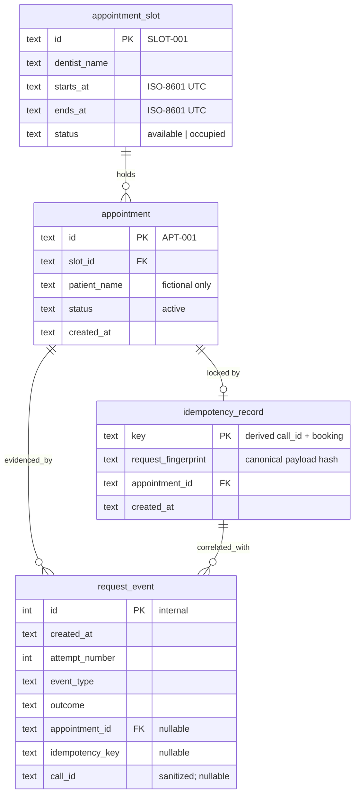

# Database

SQLite file at `DATABASE_PATH` (`data/calendar.sqlite` locally; a persistent volume path on Railway). There is no tenant model and no Postgres/RLS: one process owns the file. The application creates missing tables on startup (`SQLAlchemy metadata.create_all`); there is no Alembic migration runner.

Target after task 002: `appointment_slot`, `appointment`, `idempotency_record`, and `request_event`. Seed data is task 003. WAL mode and `BEGIN IMMEDIATE` on the booking path are part of how concurrent Retell retries stay serialized.

Timestamps are ISO-8601 UTC text. Public IDs are stable strings (`SLOT-001`, `APT-001`), not autoincrement integers. Fictional patient names only: no phone, email, medical, or payment columns.

ER diagram (product target)

Invariants the schema must enforce, including under overlapping requests:

- `idempotency_record.key` is unique.
- At most one `appointment` with `status = 'active'` per `slot_id` (partial unique index).
- `appointment.slot_id` references `appointment_slot.id` (`ON DELETE RESTRICT`).
- `idempotency_record.appointment_id` references `appointment.id` (`ON DELETE RESTRICT`).

`appointment_slot.status` is the flag availability and the dashboard read. The partial unique index is the booking lock. Both change in the same transaction.

Quick reference

| Table | Purpose |
| --- | --- |
| `appointment_slot` | Deterministic dental schedule. Stable IDs and start times the agent can speak. Seed occupied rows need no appointment; demo bookings flip `available` → `occupied`. |
| `appointment` | A created booking. Public ID returned to Retell and shown on the dashboard. Version one never reschedules or cancels, so `status` stays `active`. |
| `idempotency_record` | One row per derived key. Same key + same fingerprint returns the original appointment. Same key + different fingerprint is a conflict. This is the duplicate-prevention lock, not an audit log. |
| `request_event` | Sanitized evidence timeline. Many rows per call: receipt, idempotency decision, appointment result, response outcome (including `created_then_response_delayed` and replay). Dashboard result is computed from these rows. |

slot vs appointment vs idempotency_record vs request_event: a **slot** is a time on the fictional calendar; an **appointment** is the booking that occupies one slot; an **idempotency_record** is the business lock that makes a retry return `APT-001` instead of inserting `APT-002`; a **request_event** is one inspectable step in the demo timeline. The unique key prevents duplicates. The event log explains that it happened.
